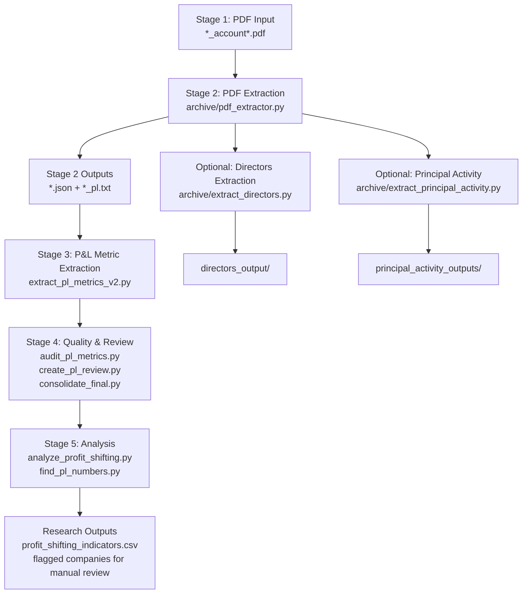

# Sample Folder — Code Documentation & Workflow Guide

This folder contains the **Double Irish / Irish corporate tax research** sample pipeline: tools that ingest Irish company annual financial statement PDFs, extract structured text and Profit & Loss (P&L) metrics, and analyze those metrics for patterns consistent with profit shifting (e.g., unusually low net margins, large gaps between operating and net profit).

The research goal is to automate the tedious first pass of reading dozens of OCR-heavy PDF filings so researchers can focus on companies that show suspicious financial patterns.

---

## For Reviewers: Find Any Code by File & Line Number

**Start here:** [`CODE_REFERENCE.md`](CODE_REFERENCE.md) — a complete index mapping every function, guardrail, output file, and research question to **exact file paths and line numbers** (e.g. `extract_pl_metrics_v2.py` lines 261–358).

Quick navigation (open file → jump to line with `Cmd+G` / `Ctrl+G`):

| If you want to see… | File | Lines |
|---------------------|------|-------|
| PDF → JSON conversion | `archive/pdf_extractor.py` | 291–324, 669–696 |
| Income statement detection (guardrails) | `extract_pl_metrics_v2.py` | 234–238, 261–358 |
| Extract Turnover / Op Profit / PBT / Net | `extract_pl_metrics_v2.py` | 643–724, 949–979 |
| Profit-shifting red-flag rules | `analyze_profit_shifting.py` | 64–90 |
| Directors extraction | `archive/pdf_extractor.py` | 327–507 |
| Principal activity extraction | `archive/extract_principal_activity.py` | 9–68 |
| Where outputs are written | See `CODE_REFERENCE.md` § "Output Files" | — |

Also see [`TECHNICAL_IMPLEMENTATION.md`](TECHNICAL_IMPLEMENTATION.md) for methodology and design rationale.

---

## Table of Contents

1. [End-to-End Workflow](#end-to-end-workflow)
2. [Directory Structure](#directory-structure)
3. [Input Data Files](#input-data-files)
4. [Active Pipeline Scripts (Root Level)](#active-pipeline-scripts-root-level)
5. [Output Artifacts (`pl_metrics_cleaned/`)](#output-artifacts-pl_metrics_cleaned)
6. [Archive Scripts (Development History)](#archive-scripts-development-history)
7. [Deep Dive: P&L Extraction Logic](#deep-dive-pl-extraction-logic)
8. [Deep Dive: Profit Shifting Analysis](#deep-dive-profit-shifting-analysis)
9. [How to Run the Pipeline](#how-to-run-the-pipeline)
10. [Dependencies](#dependencies)
11. [Known Limitations & Data Quality Notes](#known-limitations--data-quality-notes)

---

## End-to-End Workflow

The pipeline moves from raw PDF filings to actionable research outputs in five stages:



### Stage-by-Stage Summary

| Stage | Input | Script | Output | Purpose |
|-------|-------|--------|--------|---------|
| **1** | Company PDF filings | — | `*.pdf` | Raw source documents from Irish CRO / company records |
| **2** | PDFs | `archive/pdf_extractor.py` | `*.json`, `*_pl.txt` | Full text extraction + structured P&L table slice |
| **3** | `*_pl.txt` + companion `*.json` | `extract_pl_metrics_v2.py` | `pl_metrics_cleaned/*_metrics.json` | Turnover, operating profit, PBT, net profit |
| **4** | Extracted metrics | `audit_pl_metrics.py`, `create_pl_review.py`, `consolidate_final.py` | Review CSVs, audit logs, merged JSON | Validate extraction quality |
| **5** | Consolidated metrics | `analyze_profit_shifting.py` | `profit_shifting_indicators.csv` | Flag suspicious margin patterns |

---

## Directory Structure

```
sample/
├── README.md                          ← This file
├── .gitignore                         ← Ignores __pycache__, .venv, .ipynb_checkpoints
│
├── *.pdf                              ← Source financial statement PDFs (~24 companies)
├── *.json                             ← Full PDF extraction output (one per PDF)
├── *_pl.txt                           ← P&L-focused text slices (one per PDF)
│
├── extract_pl_metrics_v2.py           ← ★ Main P&L metric extractor (current version)
├── analyze_profit_shifting.py         ← ★ Profit shifting red-flag analyzer
├── audit_pl_metrics.py                ← Extraction accuracy auditor
├── create_pl_review.py                ← Data completeness review report
├── consolidate_final.py               ← Merge partial + full extractions
├── find_pl_numbers.py                 ← CLI quick-lookup for extracted numbers
│
├── pl_metrics_cleaned/                ← ★ All pipeline outputs land here
│   ├── *_metrics.json                 ← Per-file extracted metrics
│   ├── all_pl_metrics.json            ← Combined metrics array
│   ├── pl_metrics_summary.csv         ← Spreadsheet-friendly summary
│   ├── pl_metrics_review.csv          ← Completeness review
│   ├── profit_shifting_analysis.json  ← Full analysis with flags
│   └── profit_shifting_indicators.csv ← Red-flag report for researchers
│
└── archive/                           ← Earlier iterations & experimental scripts
    ├── pdf_extractor.py               ← Core PDF → JSON extractor
    ├── extract_directors*.py          ← Director name extraction variants
    ├── extract_principal_activity.py  ← Business activity section extraction
    ├── ocr_cleaner.py                 ← OCR error correction for narrative text
    ├── check_financial_tables.py      ← Verify required P&L fields exist
    ├── comprehensive_report.py        ← Combined financial + activity report
    ├── directors_output/              ← Extracted director information
    ├── scripts/                       ← Additional extraction experiments
    └── outputs/                       ← Historical run outputs
```

---

## Input Data Files

### PDF Files (`*_account*.pdf`, `*_Account*.pdf`)

Raw annual financial statement PDFs for Irish companies. Filenames encode:

- **Company registration number** (e.g., `138763`, `182294`, `81753`)
- **Reporting year** (e.g., `2021 account`)
- Some use CRO-style names (e.g., `138763-Account_details_for_ARCROYAL_LIMITED-2019-09-30.pdf`)

Example companies in the sample set include ArcRoyal Limited (138763), Gartner-related entities (182294), and others used in Double Irish structure research.

### JSON Files (`*.json`)

Produced by `archive/pdf_extractor.py`. Each JSON is a complete dump of everything extractable from one PDF:

```json
{
  "source": "/path/to/file.pdf",
  "metadata": { "title": "...", "page_count": 42, ... },
  "pages": [ { "page_number": 1, "width": 595.0, ... } ],
  "text": {
    "by_page": [ { "page": 1, "text": "..." } ],
    "full_text": "..."
  },
  "images": [...],
  "links": [...],
  "profit_and_loss_table": {
    "heading": "Profit and loss account",
    "raw_block": "...",
    "rows": [ { "label": "Turnover", "values": ["31,442", "38,685"] } ]
  }
}
```

The `text.by_page` and `text.full_text` fields are critical for `extract_pl_metrics_v2.py`, which reads the companion JSON (same stem as the `_pl.txt` file) for higher-fidelity statement parsing than OCR text alone.

### P&L Text Files (`*_pl.txt`)

Human-readable text slices focused on the income statement. Generated two ways:

1. **Structured table export** — When `pdf_extractor.py` finds a parseable P&L table, it writes labeled rows:

```
Profit and loss account
=======================

Turnover:  31,442  38,685
Operating profit:  2,086  1,950
...
```

2. **Full-page OCR text** — When no clean table is found, the file may contain broader OCR output from the entire document (director reports, auditor letters, notes). Extraction scripts must locate the actual income statement within this noise.

---

## Active Pipeline Scripts (Root Level)

These six scripts form the **current production pipeline**. Run them from the `sample/` directory.

---

### `extract_pl_metrics_v2.py` — Main P&L Metric Extractor

**Purpose:** Parse every `*_pl.txt` file (with its companion `*.json`) and extract four key financial metrics used in profit-shifting research.

**Metrics extracted:**

| Field | Aliases searched |
|-------|-----------------|
| `turnover` | revenue, sales revenue, net sales |
| `operating_profit` | operating loss, EBIT, operating income |
| `profit_before_tax` | PBT, EBT, loss before tax |
| `profit_loss_for_year` | net income, profit for the financial year |

**Entry point — batch processing all P&L files:**

```1027:1064:sample/extract_pl_metrics_v2.py
def process_all_pl_files():
    """Process all P&L files and save cleaned data."""

    workspace = Path(__file__).resolve().parent
    pl_files = sorted(workspace.glob('*_pl.txt'))
    
    print(f"Found {len(pl_files)} P&L files")
    
    output_folder = workspace / 'pl_metrics_cleaned'
    output_folder.mkdir(exist_ok=True)
    
    all_metrics = []
    
    for file_path in pl_files:
        print(f"Processing: {file_path.name}")
        metrics = extract_pl_metrics(file_path)
        all_metrics.append(metrics)
        
        json_output = output_folder / f"{metrics['filename']}_metrics.json"
        with open(json_output, 'w') as f:
            json.dump(metrics, f, indent=2)
    
    # Save summary CSV
    csv_output = output_folder / 'pl_metrics_summary.csv'
    ...
```

**Core extraction function — multi-pass strategy:**

```883:920:sample/extract_pl_metrics_v2.py
def extract_pl_metrics(file_path: Path) -> Dict:
    """Extract P&L metrics from a single file."""
    
    with open(file_path, 'r', encoding='utf-8', errors='ignore') as f:
        content = f.read()
        txt_lines = content.split('\n')

    # Try companion JSON first, then append TXT lines as fallback/source fusion.
    base_name = file_path.stem.replace("_pl", "")
    companion_json = file_path.parent / f"{base_name}.json"
    json_lines = extract_lines_from_json(companion_json)
    lines = json_lines + txt_lines if json_lines else txt_lines
    statement_source_text = extract_statement_source_text(companion_json)
    ...
    # First pass: read directly from statement table block when available.
    block_metrics = extract_metrics_from_statement_block(
        statement_source_text, filename_stem=base_name
    )
```

**Extraction passes (in priority order):**

1. **Statement-block extraction** — Locates the P&L section in JSON full text via `find_best_statement_block()`, then parses table layout (inline rows, stacked year columns, or interleaved OCR columns).
2. **Keyword neighborhood search** — Within 220 lines of the income statement heading, searches for metric labels and pulls the largest numeric value on the same or following lines.
3. **Full-document fallback** — Only runs if statement-block extraction populated fewer than 2 metrics (avoids OCR garbage overriding good table reads).

**Number parsing — handles accounting conventions:**

```12:44:sample/extract_pl_metrics_v2.py
def extract_number(text: str) -> Optional[float]:
    """Extract numeric value from text, handling accounting formats."""
    ...
    # Skip obvious year-like noise that is often captured in OCR text
    if abs(value) in {2014.0, 2015.0, 2016.0, ...}:
        continue
    candidates.append(value)
    ...
    # Prefer the largest magnitude number on the line (usually the financial amount)
    return max(candidates, key=lambda x: abs(x))
```

Parentheses denote negatives `(1,234)` → `-1234`. Year values (2014–2026) are filtered out so page references like "page 8" do not become turnover.

**OCR-tolerant label matching:**

```195:214:sample/extract_pl_metrics_v2.py
def normalize_pl_label(line: str) -> str:
    """Collapse OCR noise on P&L row labels for fuzzy matching."""
    s = re.sub(r"[^a-z0-9]", "", line.lower())
    s = s.replace("1", "l").replace("0", "o")
    replacements = (
        ("turniwer", "turnover"),
        ("operatingpol1e", "operatingprofit"),
        ...
    )
```

**Output schema (per file):**

```json
{
  "filename": "138763_2021 account_pl",
  "turnover": 31442.0,
  "operating_profit": 680.0,
  "profit_before_tax": 586.0,
  "profit_loss_for_year": 465.0,
  "currency": "EUR",
  "raw_data": ["turnover: statement-block extraction", ...],
  "confidence": "high"
}
```

`raw_data` records which extraction pass found each value. `confidence` is `high` when ≥3 metrics found or PBT/net profit located in the statement neighborhood.

**Run:**

```bash
cd sample
python extract_pl_metrics_v2.py
```

---

### `analyze_profit_shifting.py` — Profit Shifting Red-Flag Analyzer

**Purpose:** Reads `pl_metrics_cleaned/all_pl_metrics.json`, computes profit margins, and flags records that may indicate profit shifting or aggressive tax planning.

**Grouping logic — companies tracked across years:**

```21:35:sample/analyze_profit_shifting.py
    # Group by company (ignore year)
    companies: Dict[str, List[Dict]] = {}
    for m in metrics_list:
        filename = m["filename"]
        if "_" in filename:
            company_id = filename.split("_")[0]
        else:
            company_id = filename
        ...
        companies[company_id].append(m)
```

**Red-flag rules:**

```63:90:sample/analyze_profit_shifting.py
            # Calculate profit margins
            if analysis['profit_for_year'] is not None and analysis['profit_for_year'] != 0:
                net_profit_margin = (analysis['profit_for_year'] / m['turnover']) * 100
                ...
                if net_profit_margin < 1:
                    analysis['flags'].append(f"Low net margin ({net_profit_margin:.2f}%)")
                if net_profit_margin < 0:
                    analysis['flags'].append(f"Negative net margin ({net_profit_margin:.2f}%)")
            ...
            # Flag: Large difference between operating and net profit
            if (m['operating_profit'] is not None and analysis['profit_for_year'] is not None):
                profit_diff = abs(m['operating_profit'] - analysis['profit_for_year'])
                if profit_diff > m['turnover'] * 0.1:
                    analysis['flags'].append(
                        f"Large profit reduction ({profit_diff:.0f} difference). ..."
                    )
```

| Flag | Condition | Research interpretation |
|------|-----------|----------------------|
| Low net margin | Net margin < 1% | Revenue recognized but almost no bottom-line profit — possible transfer pricing |
| Negative net margin | Net margin < 0% | Operating losses or heavy below-the-line charges |
| Large profit reduction | \|Operating − Net\| > 10% of turnover | Interest, royalties, or related-party charges eroding profit |
| Unusual operating vs net | Operating < 50% of net profit | Rare; may indicate data extraction error |

**Outputs:**

- `pl_metrics_cleaned/profit_shifting_analysis.json` — Full analysis with all flags
- `pl_metrics_cleaned/profit_shifting_indicators.csv` — Spreadsheet for manual review

**Run:**

```bash
python analyze_profit_shifting.py
```

---

### `audit_pl_metrics.py` — Extraction Accuracy Auditor

**Purpose:** Compares what `extract_pl_metrics()` returns against a reference extraction directly from the JSON statement block. Catches cases where fallback keyword search picked up wrong numbers.

```17:48:sample/audit_pl_metrics.py
def main() -> None:
    workspace = Path(__file__).resolve().parent
    pl_files = sorted(workspace.glob("*_pl.txt"))

    mismatches = []
    for pl_path in pl_files:
        stem = pl_path.stem.replace("_pl", "")
        json_path = workspace / f"{stem}.json"
        extracted = extract_pl_metrics(pl_path)
        ref = extract_metrics_from_statement_block(
            extract_statement_source_text(json_path), stem
        )
        ...
        for key in ("turnover", "operating_profit", "profit_before_tax", "profit_loss_for_year"):
            ex = extracted.get(key)
            rf = ref.get(key)
            if rf is not None and ex != rf:
                mismatches.append({...})
```

Writes `pl_metrics_cleaned/audit_mismatches.json` for manual correction.

**Run:**

```bash
python audit_pl_metrics.py
```

---

### `create_pl_review.py` — Data Completeness Review

**Purpose:** Generates `pl_metrics_review.csv` showing what percentage of the four target metrics were successfully extracted per file, with notes for incomplete records.

```23:36:sample/create_pl_review.py
def calculate_completeness(m: Dict[str, Any]) -> float:
    """Calculate data completeness percentage for a metric."""
    keys = ["turnover", "operating_profit", "profit_before_tax", "profit_loss_for_year"]
    return sum(1 for k in keys if m.get(k) is not None) / len(keys) * 100

def get_notes_for_metric(m: Dict[str, Any], completeness: float) -> List[str]:
    notes = []
    if completeness < 50:
        notes.append("INCOMPLETE - May need manual extraction")
    if m.get("currency") == "Unknown":
        notes.append("Currency not detected")
    return notes
```

**Run:**

```bash
python create_pl_review.py
```

---

### `consolidate_final.py` — Merge Partial Extractions

**Purpose:** Merges individually corrected `*_metrics.json` files with the batch output in `all_pl_metrics.json`, preferring manually verified values where they exist.

```41:77:sample/consolidate_final.py
def merge_metrics(
    existing_metrics: Dict[str, Any], table_metrics: List[Dict[str, Any]]
) -> List[Dict[str, Any]]:
    ...
    for m in table_metrics:
        fname = m["filename"]
        if fname in existing_metrics:
            final = existing_metrics[fname].copy()
        else:
            final = { "filename": fname, ... }

        # Merge in table data where missing
        for key in ["turnover", "operating_profit", "profit_before_tax", "profit_loss_for_year"]:
            if final.get(key) is None and m.get(key) is not None:
                final[key] = m[key]
```

Writes `pl_metrics_cleaned/all_pl_metrics_final.json`.

**Run:**

```bash
python consolidate_final.py
```

---

### `find_pl_numbers.py` — Quick Lookup CLI

**Purpose:** Human-friendly terminal display of all extracted metrics. Supports searching by company ID.

```82:102:sample/find_pl_numbers.py
def find_pl_numbers() -> None:
    """Main function."""
    companies = load_companies()
    ...
    print(f"CSV (Quick View):")
    print(f"  → {CSV_FILE}")
    print(f"\nJSON (Full Data):")
    print(f"  → {METRICS_FOLDER}/all_pl_metrics.json")
```

**Run:**

```bash
python find_pl_numbers.py                  # Show all companies
python find_pl_numbers.py 138763           # Search for ArcRoyal
```

---

## Output Artifacts (`pl_metrics_cleaned/`)

| File | Created by | Description |
|------|-----------|-------------|
| `{filename}_metrics.json` | `extract_pl_metrics_v2.py` | Per-statement extraction with confidence & raw_data provenance |
| `all_pl_metrics.json` | `extract_pl_metrics_v2.py` | Array of all per-file metrics |
| `all_pl_metrics_final.json` | `consolidate_final.py` | Merged final dataset after manual corrections |
| `pl_metrics_summary.csv` | `extract_pl_metrics_v2.py` | One-row-per-file spreadsheet |
| `pl_metrics_review.csv` | `create_pl_review.py` | Completeness percentages and review notes |
| `audit_mismatches.json` | `audit_pl_metrics.py` | Extraction vs reference mismatches |
| `profit_shifting_analysis.json` | `analyze_profit_shifting.py` | Full analysis with company grouping |
| `profit_shifting_indicators.csv` | `analyze_profit_shifting.py` | Red flags column for research triage |

---

## Archive Scripts (Development History)

The `archive/` folder preserves earlier extraction approaches and supplementary data pulls. These are not required for the main P&L → analysis pipeline but document how the project evolved.

---

### `archive/pdf_extractor.py` — PDF → JSON + P&L Text (Stage 2 Core)

**Purpose:** The foundational extractor. Uses **PyMuPDF (`fitz`)** to pull metadata, page text, images, links, annotations, form fields, table of contents, fonts, and a best-effort P&L table parse from each PDF.

**Main extraction orchestrator:**

```291:321:sample/archive/pdf_extractor.py
def extract_all_attributes(pdf_path: Union[str, Path], include_image_bytes: bool = False) -> dict:
    ...
    result = {
        "source": str(pdf_path.resolve()),
        "metadata": extract_metadata(doc),
        "pages": [extract_page_attributes(doc, i) for i in range(doc.page_count)],
        "text": extract_text(doc),
        "images": extract_images(doc, extract_bytes=include_image_bytes),
        ...
        "profit_and_loss_table": None,
    }
    pl = extract_profit_and_loss_table(result)
    if pl is not None:
        result["profit_and_loss_table"] = pl
    return result
```

**P&L table detection — finds heading then parses rows:**

```220:271:sample/archive/pdf_extractor.py
def extract_profit_and_loss_table(data: dict) -> Optional[dict]:
    text = (data.get("text") or {}).get("full_text") or ""
    heading_re = re.compile(
        r"(PROFIT\s+AND\s+LOSS\s+ACCOUNT|PROFIT\s+AND\s+LOSS\s+STATEMENT|STATEMENT\s+OF\s+COMPREHENSIVE\s+INCOME)",
        re.IGNORECASE,
    )
    ...
    rows = _parse_pl_table_block(block)
    return {"heading": heading, "raw_block": block, "rows": rows}
```

**CLI — writes one JSON per PDF and optional `_pl.txt`:**

```669:696:sample/archive/pdf_extractor.py
    for pdf_path in pdf_paths:
        data = extract_all_attributes(pdf_path, include_image_bytes=include_image_sizes)
        json_path = pdf_path.with_suffix(".json")
        json_path.write_text(json.dumps(data, indent=2, default=str), encoding="utf-8")
        pl = data.get("profit_and_loss_table")
        if pl:
            txt_name = pdf_path.stem + "_pl.txt"
            ...
            txt_path.write_text("\n".join(lines) + "\n", encoding="utf-8")
```

**Also extracts:** company name (`extract_company_name`), year ended (`extract_year_ended`), current directors (`extract_current_directors`).

**Run:**

```bash
cd sample/archive
python pdf_extractor.py /path/to/sample/folder
```

---

### `archive/extract_directors.py` — Director & Company Metadata

**Purpose:** Batch-extracts company name, financial year ended, and current directors from PDFs. Uses functions imported from `pdf_extractor_withnotes.py`.

```27:46:sample/archive/extract_directors.py
def extract_directors_from_pdf(pdf_path):
    data = extract_all_attributes(pdf_path, include_image_bytes=False)
    company_name = extract_company_name(data)
    year_ended = extract_year_ended(data)
    current_directors = extract_current_directors(data)
    return {
        "file": pdf_path.name,
        "company_name": company_name,
        "year_ended": year_ended,
        "current_directors": current_directors,
    }
```

Outputs to `archive/directors_output/` as JSON and individual `*_directors.txt` files.

---

### `archive/extract_principal_activity.py` — Business Activity Narrative

**Purpose:** Extracts the "Principal Activity", "Business Review", or "Operations" section from `_pl.txt` or account text files. Useful for understanding what a company actually does (manufacturing, holding company, IP licensing, etc.) — context for interpreting profit margins.

```22:38:sample/archive/extract_principal_activity.py
        for i, line in enumerate(lines):
            line_lower = line.lower().strip()
            if re.match(r'^principal', line, re.IGNORECASE):
                section_line_idx = i
                section_name = "Principal Activity"
                break
            elif re.match(r'^business\s+review', line, re.IGNORECASE):
                ...
```

Outputs to `archive/outputs/principal_activity_outputs/`.

---

### `archive/ocr_cleaner.py` — OCR Error Correction

**Purpose:** Post-processes corrupted OCR text from principal activity extractions using a dictionary of known OCR substitutions (e.g., `"Ct;tnpany"` → `"company"`).

Reads from `principal_activity_outputs/`, writes cleaned text to `principal_activity_cleaned/`.

---

### `archive/check_financial_tables.py` — Field Presence Verification

**Purpose:** Checks whether extracted text files contain all six standard Irish P&L row labels:

- Turnover, Gross profit, Net operating expenses, Profit/(loss) before taxation, Taxation, Profit/(loss) for the financial year

Useful for identifying PDFs where OCR failed before running metric extraction.

---

### `archive/comprehensive_report.py` — Combined Coverage Report

**Purpose:** Single report combining financial table field coverage and principal activity extraction success across all documents.

---

### `archive/scripts/` — Experimental Extractors

| Script | Purpose |
|--------|---------|
| `fresh_ocr_extraction.py` | Alternative OCR via `pdfplumber` + `pytesseract` for image-based PDFs |
| `enhanced_ocr_extraction.py` | Extended OCR pipeline with table detection |
| `extract_pl_metrics.py` | Earlier version of P&L metric extraction (superseded by `extract_pl_metrics_v2.py`) |
| `extract_cleaned.py` | Fuzzy-matching metric extraction with OCR noise handling |
| `extract_table_metrics.py` | Table-structure-aware metric parser |
| `extract_directors_final.py` | Final iteration of director extraction from text |
| `principal_activity.py` | Script version of principal activity extraction |
| `consolidate_metrics.py` | Earlier metrics consolidation |
| `show_pl_table.py` | Debug utility to display parsed P&L tables |
| `debug_json.py` | JSON structure inspector for troubleshooting |
| `pdf_extractor_withnotes.py` | Annotated version of `pdf_extractor.py` with inline research notes |

---

## Deep Dive: P&L Extraction Logic

Understanding how `extract_pl_metrics_v2.py` handles the hardest cases is essential for interpreting results.

### Step 1: Locate the Income Statement Block

`find_best_statement_block()` scans JSON full text for headings like "Profit and loss account", scores candidate sections, and rejects false positives (auditor reports, balance sheets, table of contents):

```261:328:sample/extract_pl_metrics_v2.py
def find_best_statement_block(full_text: str) -> str:
    direct_patterns = [
        (r"Profit and loss account and other comprehensive income\s+for the year ended.*?(?=\n\s*Balance sheet\b)", ...),
        (r"Statement of Profit and Loss\s+for the year ended.*?(?=\n\s*Statement of Other|\n\s*Balance Sheet\b)", ...),
    ]
    ...
    for sm in starts:
        ...
        if not fuzzy_has_turnover(first_chunk):
            continue
        if "tangible fixed assets" in first_chunk or "current assets" in first_chunk:
            continue
        if "independent auditor" in first_chunk:
            continue
        score = 0
        if "for the year ended" in block_lower: score += 8
        if fuzzy_has_turnover(first_chunk): score += 6
        ...
```

### Step 2: Detect Table Layout

Three layouts are supported:

| Layout | Detection | Extractor function |
|--------|-----------|-------------------|
| **Inline rows** | `Turnover 2 34,711 38,685` on one line | `extract_inline_pl_metrics()` |
| **Stacked year columns** | `2018\n€'000\n668,926\n...` | `extract_columnar_pl_metrics()` |
| **Interleaved OCR** | `2018\n2017\n€'000\n668,926\n600,975\n...` | `extract_interleaved_columnar_pl_metrics()` |
| **Gartner OCR pairs** | Heavily corrupted numeric lines | `extract_ocr_gartner_pair_metrics()` |

**Year column selection** uses the filename year vs. the "year ended" date in the statement:

```440:467:sample/extract_pl_metrics_v2.py
def resolve_target_year(stem_year, report_year, available_years):
    if stem_year and report_year and stem_year == report_year and stem_year in available_years:
        return stem_year, notes
    if stem_year and stem_year in available_years:
        if report_year and stem_year < report_year:
            notes.append(f"using comparative column {stem_year} from FY{report_year} report")
        return stem_year, notes
    ...
```

For a `2019 account.pdf` that contains both 2019 and 2018 columns, the extractor picks the 2019 (current year) column.

### Step 3: Keyword Fallback

When table parsing fails, `find_metric_value()` searches for keyword matches and extracts the largest number after the label, skipping narrative prose and small reference numbers (note numbers like "2" or "7"):

```832:880:sample/extract_pl_metrics_v2.py
def find_metric_value(lines, keywords, context_lines=10, min_abs=1.0):
    for i, line in enumerate(lines):
        matched_keyword = next(
            (keyword for keyword in keywords if keyword.lower() in line_lower), None
        )
        if matched_keyword:
            same_line_from_keyword = extract_value_after_keyword(line, matched_keyword, min_abs)
            ...
            for j in range(1, context_lines + 1):
                value = extract_number(next_line)
                if value is not None and abs(value) >= min_abs:
                    return (value, i + j)
```

Turnover uses `min_abs=500.0` to avoid picking up note references; other metrics use `min_abs=50.0`.

---

## Deep Dive: Profit Shifting Analysis

### What We Are Looking For

In Double Irish / BEPS research, Irish subsidiaries of multinational groups sometimes show:

1. **High turnover, near-zero net profit** — Revenue is booked in Ireland but profit is shifted via royalties, management fees, or intercompany interest to low-tax jurisdictions.
2. **Operating profit >> net profit** — The company appears operationally healthy but tax/interest charges eliminate most bottom-line profit.
3. **Year-over-year margin collapse** — A restructuring year where intercompany arrangements change (e.g., ArcRoyal transitioning to affiliate-only sales in 2020).

### Example: Flagged Record

Company `138763` (ArcRoyal) in 2021 shows operating profit of €680k against turnover of €31,442k (~2.2% operating margin) but the analysis framework would flag cases where net profit drops disproportionately due to tax or interest lines between operating profit and net profit.

The `_pl.txt` for this company also contains narrative confirming affiliate transfer pricing:

```
Principal activities
The company manufactures and sells custom sterile procedural packs...
From 01 May 2020 ArcRoyal no longer sells to third party customers — it now sells
all its product to affiliate companies O&M Halyard Ireland, O&M Halyard UK, ...
```

This context (from principal activity extraction) helps researchers distinguish legitimate restructuring from tax-motivated profit shifting.

---

## How to Run the Pipeline

### Full pipeline (from scratch)

```bash
cd sample

# Stage 2: Extract PDFs to JSON + _pl.txt (only needed for new PDFs)
python archive/pdf_extractor.py .

# Stage 3: Extract P&L metrics
python extract_pl_metrics_v2.py

# Stage 4: Quality checks
python audit_pl_metrics.py
python create_pl_review.py
python consolidate_final.py

# Stage 5: Profit shifting analysis
python analyze_profit_shifting.py

# Quick lookup
python find_pl_numbers.py
```

### Re-run analysis only (metrics already extracted)

```bash
python analyze_profit_shifting.py
python find_pl_numbers.py
```

### Optional supplementary extractions

```bash
python archive/extract_directors.py
python archive/extract_principal_activity.py
python archive/check_financial_tables.py
```

---

## Dependencies

| Package | Used by | Purpose |
|---------|---------|---------|
| `pymupdf` (`fitz`) | `pdf_extractor.py` | PDF text and metadata extraction |
| `pdfplumber` | `fresh_ocr_extraction.py` | Alternative PDF text/table extraction |
| `pytesseract` | `fresh_ocr_extraction.py` | OCR for scanned PDF pages |
| `Pillow` | `fresh_ocr_extraction.py` | Image handling for OCR |

Standard library only for the active pipeline (`extract_pl_metrics_v2.py`, `analyze_profit_shifting.py`, etc.): `re`, `json`, `csv`, `pathlib`.

Install PDF extraction dependencies:

```bash
pip install pymupdf
# Optional OCR path:
pip install pdfplumber pytesseract Pillow
```

---

## Known Limitations & Data Quality Notes

### Extraction challenges

- **OCR corruption** — Older scanned PDFs (especially Gartner entity 182294) produce garbled headings like `"P. rotlt and loss acct"`. The fuzzy matchers handle many cases but not all.
- **Multiple currencies** — Values in `€'000`, `$000`, or `£000` are parsed as raw numbers; currency is detected separately and stored in the `currency` field.
- **Consolidated vs standalone** — Some PDFs contain group statements; the extractor takes the first matching P&L block, which may not always be the Irish entity standalone account.
- **Incomplete `_pl.txt` files** — When `pdf_extractor.py` cannot find a structured P&L table, the `_pl.txt` may be empty or contain only a header line (~2 KB). These files typically yield no metrics.
- **Filename year vs column year** — Comparative columns (prior year) can be mistaken if filename parsing fails; check `raw_data` notes in the JSON output.

### Extraction performance (approximate)

| Category | Count | Description |
|----------|-------|-------------|
| Fully extracted (4/4 metrics) | ~2 files | Ready for analysis without manual review |
| Partially extracted (2–3/4) | ~11 files | Usable with caveats |
| Unable to extract | ~11 files | Header-only or severely corrupted OCR |

Always run `audit_pl_metrics.py` and review `pl_metrics_review.csv` before drawing research conclusions.

### Confidence scoring

| Level | Criteria |
|-------|----------|
| `high` | ≥3 metrics found, or PBT/net profit found in statement neighborhood |
| `medium` | ≥1 metric found |
| `low` | Default; no strong matches |

Check `raw_data` in each `*_metrics.json` to see whether values came from `"statement-block extraction"` (preferred) or keyword fallback.

---

## Research Workflow: Beginning to End

1. **Acquire PDFs** — Download Irish company financial statements from CRO / company records. Name files `{company_number}_{year} account.pdf`.

2. **Extract text** — Run `archive/pdf_extractor.py .` to produce companion `.json` (full text) and `_pl.txt` (P&L slice) for each PDF.

3. **Extract metrics** — Run `extract_pl_metrics_v2.py`. Review `pl_metrics_cleaned/pl_metrics_summary.csv` for obvious gaps.

4. **Validate** — Run `audit_pl_metrics.py` and inspect `audit_mismatches.json`. Manually fix any incorrect `*_metrics.json` files.

5. **Review completeness** — Run `create_pl_review.py`. Focus manual effort on files marked `INCOMPLETE`.

6. **Consolidate** — Run `consolidate_final.py` to merge manual corrections into `all_pl_metrics_final.json`.

7. **Analyze** — Run `analyze_profit_shifting.py`. Open `profit_shifting_indicators.csv` and sort by red flags.

8. **Deep dive** — For flagged companies:
   - Read the full `_pl.txt` and companion `.json` for interest/tax line items
   - Run `archive/extract_principal_activity.py` for business context
   - Run `archive/extract_directors.py` for governance / related-party clues
   - Compare year-over-year metrics for the same `company_id`

9. **Report** — Use extracted metrics, flags, and narrative context to support Double Irish / BEPS research findings.

---

*Part of the DoubleIrishResearch project — Spring/Summer research with Dr. Grant, Villanova University.*
